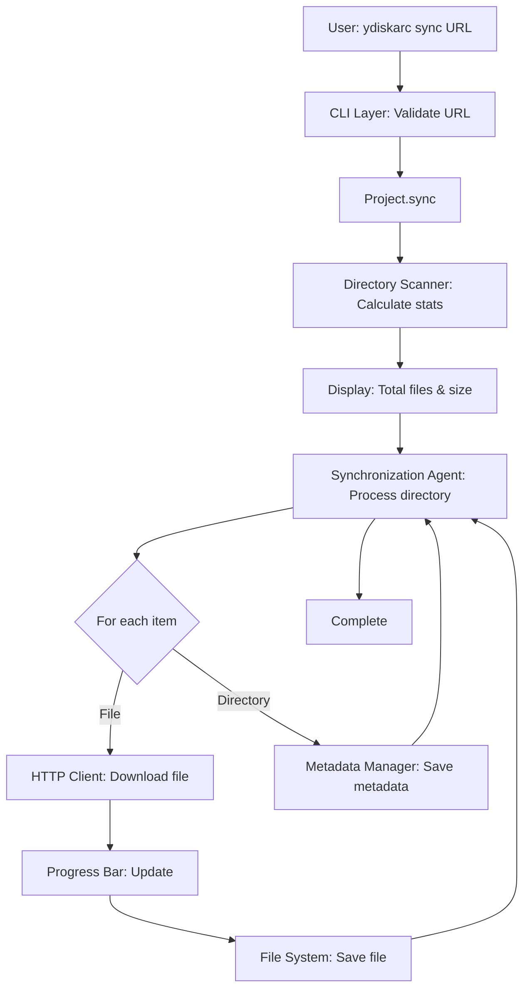
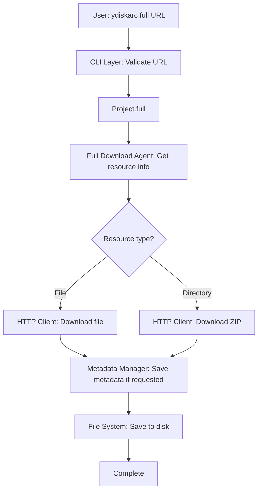

<!-- OPENSPEC:START -->
# OpenSpec Instructions

These instructions are for AI assistants working in this project.

Always open `@/openspec/AGENTS.md` when the request:
- Mentions planning or proposals (words like proposal, spec, change, plan)
- Introduces new capabilities, breaking changes, architecture shifts, or big performance/security work
- Sounds ambiguous and you need the authoritative spec before coding

Use `@/openspec/AGENTS.md` to learn:
- How to create and apply change proposals
- Spec format and conventions
- Project structure and guidelines

Keep this managed block so 'openspec update' can refresh the instructions.

<!-- OPENSPEC:END -->

# AGENTS.md

## Architecture Overview

**ydiskarc** is a command-line tool designed to backup public resources from Yandex.Disk. The architecture follows a modular design with distinct components that handle different aspects of the backup process.

## Core Components

### 1. CLI Layer (`core.py`)

**Purpose**: Command-line interface and user interaction

**Responsibilities**:
- Exposes user-facing commands (`sync`, `full`, `version`)
- Validates user input and URLs
- Manages logging configuration
- Routes commands to the appropriate processor

**Key Functions**:
- `setup_logging()` - Configures logging based on verbosity
- `full()` - Command handler for full resource downloads
- `sync()` - Command handler for directory synchronization
- `version()` - Displays version information

**Technology**: Built with [Typer](https://typer.tiangolo.com/) for modern CLI development

---

### 2. Project Processor (`cmds/processor.py`)

**Purpose**: Core business logic for resource backup and synchronization

**Responsibilities**:
- Orchestrates the backup workflow
- Manages configuration (OAuth keys)
- Delegates to specialized functions for different operations

**Key Methods**:
- `configure()` - Sets up Yandex OAuth authentication
- `sync()` - Synchronizes directory resources
- `full()` - Downloads complete resources (files or directories)
- `__store()` - Internal method for storing resources

**Design Pattern**: Facade pattern - provides a simplified interface to complex subsystems

---

### 3. HTTP Client Agent

**Purpose**: Handles all HTTP communication with Yandex.Disk API

**Responsibilities**:
- Creates resilient HTTP sessions with retry logic
- Manages rate limiting (429 responses)
- Handles network failures gracefully
- Supports resume capability for interrupted downloads

**Key Functions**:
- `create_session_with_retries()` - Configures HTTP session with exponential backoff
- `handle_rate_limit()` - Implements rate limit waiting strategy
- `get_file()` - Downloads files with progress tracking and resume support

**Features**:
- **Retry Strategy**: 3 retries with exponential backoff (0.5s, 1s, 2s)
- **Rate Limiting**: Automatic detection and waiting based on `Retry-After` header
- **Resume Support**: Detects partial downloads and continues from last byte
- **Progress Tracking**: Uses `tqdm` for visual progress bars

---

### 4. Metadata Manager

**Purpose**: Extracts and stores resource metadata

**Responsibilities**:
- Fetches metadata from Yandex.Disk API
- Stores metadata as `_metadata.json` files
- Preserves directory structure metadata

**API Endpoints**:
- `YD_API` - Resource metadata endpoint
- `YD_API_DOWNLOAD` - Download URL generation endpoint

**Metadata Structure**: See [METADATA_STRUCTURE.md](examples/METADATA_STRUCTURE.md) for details

---

### 5. Directory Scanner

**Purpose**: Pre-download analysis and statistics

**Responsibilities**:
- Recursively scans directory structures
- Calculates total file count and size
- Identifies files to skip in update mode
- Provides pre-download statistics to users

**Key Functions**:
- `scan_directory_for_stats()` - Analyzes directory before download
- `format_size()` - Converts bytes to human-readable format

**Output Example**:
```
Total files to download: 7
Total size: 10.12 MB
```

---

### 6. Synchronization Agent

**Purpose**: Manages directory synchronization workflow

**Responsibilities**:
- Recursively processes directory structures
- Maintains local directory hierarchy
- Handles update mode (skip existing files)
- Supports metadata-only mode

**Key Functions**:
- `yd_get_and_store_dir()` - Recursive directory processing
- Implements both iterative and recursive traversal

**Modes**:
- **Full Sync**: Downloads all files and metadata
- **Update Mode**: Only downloads new files
- **Metadata-Only**: Saves metadata without downloading files

---

### 7. Full Download Agent

**Purpose**: Handles complete resource downloads

**Responsibilities**:
- Downloads single files with original format
- Downloads directories as ZIP archives
- Optionally extracts and saves metadata

**Key Functions**:
- `yd_get_full()` - Orchestrates full download process

**Behavior**:
- **Files**: Downloaded with original filename and format
- **Directories**: Downloaded as ZIP files (default: `dump.zip`)

---

### 8. Configuration Manager (`config.py`)

**Purpose**: Centralized configuration management

**Responsibilities**:
- Loads configuration from `.ydiskarc` YAML file
- Provides default values
- Manages API endpoints and user agent strings

**Configuration Options**:
```yaml
keys:
  yandex_oauth: your_oauth_key_here
```

---

## Data Flow

### Sync Command Flow



### Full Command Flow



---

## Error Handling Strategy

### Network Resilience

1. **Automatic Retries**: 3 attempts with exponential backoff
2. **Rate Limiting**: Automatic detection and waiting
3. **Resume Support**: Continues interrupted downloads from last byte
4. **Connection Pooling**: Reuses connections for efficiency

### User Feedback

1. **Verbose Mode**: Detailed logging when enabled with `-v` flag
2. **Progress Bars**: Visual feedback using `tqdm`
3. **Pre-download Stats**: Shows what will be downloaded before starting
4. **Error Messages**: Clear, actionable error messages

---

## Extension Points

### Adding New Commands

1. Add command handler in `core.py` using `@app.command()` decorator
2. Implement business logic in `Project` class
3. Add specialized functions in `processor.py` as needed

### Custom Download Strategies

The `get_file()` function supports:
- Custom chunk sizes (default: 1MB)
- Alternative download tools (aria2 support)
- Custom headers and parameters
- Resume capability toggle

### Metadata Processing

Metadata is stored as JSON and can be extended:
- Add custom metadata extractors
- Implement metadata transformations
- Create metadata indexing systems

---

## Dependencies

### Core Libraries

- **typer**: Modern CLI framework
- **requests**: HTTP client library
- **tqdm**: Progress bar library
- **pyyaml**: Configuration file parsing
- **rich**: Terminal formatting

### Python Version

- Requires Python 3.6 or greater

---

## Testing Strategy

Tests are located in the `tests/` directory. See [tests/README.md](tests/README.md) for details.

**Development Setup**:
```bash
pip install -r requirements-dev.txt
pytest
```

**Code Quality Tools**:
- **Black**: Code formatting (line length: 100)
- **flake8**: Linting
- **ruff**: Fast Python linter
- **isort**: Import sorting

---

## Future Enhancements

### Potential Agent Additions

1. **Parallel Download Agent**: Multi-threaded downloads for faster backups
2. **Compression Agent**: On-the-fly compression for storage optimization
3. **Deduplication Agent**: Detect and skip duplicate files
4. **Verification Agent**: Checksum verification for downloaded files
5. **Notification Agent**: Send notifications on completion or errors
6. **Scheduling Agent**: Automated periodic backups

### API Extensions

- Support for private resources (with OAuth)
- Incremental backups with change detection
- Selective file filtering (by extension, size, date)
- Cloud storage integration (S3, Google Drive, etc.)

---

## Contributing

See [README.md](README.md#contributing) for contribution guidelines.

---

## License

MIT License - See [LICENSE](LICENSE) file for details.

---

## Links

- **Repository**: https://github.com/ruarxive/ydiskarc/
- **Issues**: https://github.com/ruarxive/ydiskarc/issues
- **Yandex.Disk API**: https://yandex.com/dev/disk/api/
